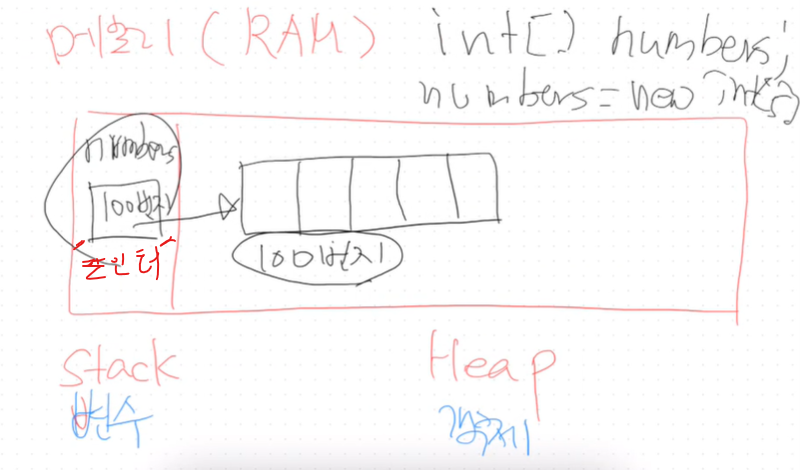
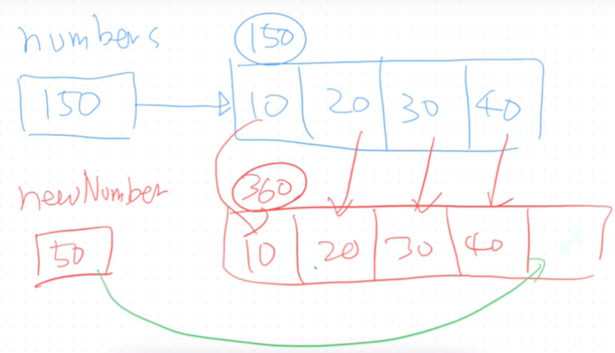
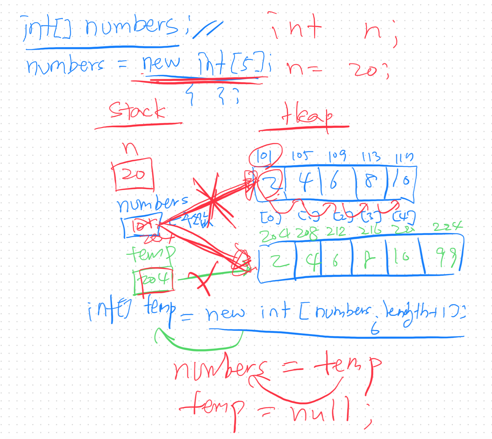
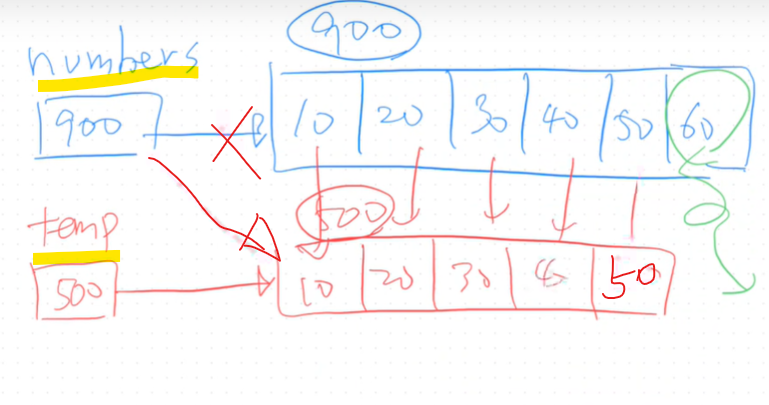
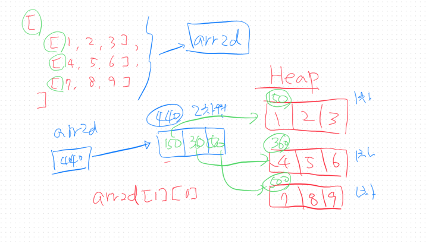

### 🟩배열의 특징  
1. 동종 모음 구조 : 같은 타입의 데이터만 배열에 담을 수 있음  
      ㄴ 같은 타입만 담아라..  
2. 크기가 불변함: 크기가 동적으로 늘이거나 줄일 수 없음  

### 배열의 생성 순서
1. 배열 변수 선언
```
int[] numbers;
```
2. 배열의 객체를 생성
   numbers = new int[5];  //방 갯수 지정
```
   System.out.println("numbers = " + numbers);
   //        numbers = [I@5ebec15    주소값이 찍힌다! 방의 위치를 저장하고 있음.!
```
3. 배열 값 초기화
```
   numbers[0] = 50;
   numbers[1] = 77;
```
---
### 배열 순회 forEach 스타일
```
for(타입 변수: 배열)
```
```
for(int n : numbers){
System.out.println("n = "+n);
}
```
#### 배열 한번에 만들기
```
int[] pointList = new int[]{10,20,30,40};
System.out.println(Arrays.toString(pointList));
```
#### 배열에 값을 안넣고 생성만 하면?
####  -> 각 타입의 기본값으로 미리 값을 넣어놓음
기본값: 정수 0 실수 0.0 , 논리 false 문자 : 공백 , 기타 = null  
byte[] bArr = new byte[3];  

---
### 배열 선언

### 배열 PUSH


### 배열 pop


### 2차원 배열

#### 2차원 배열 전체 출력
Arrays.deepToString
System.out.println(Arrays.deepToString(classScores));  

